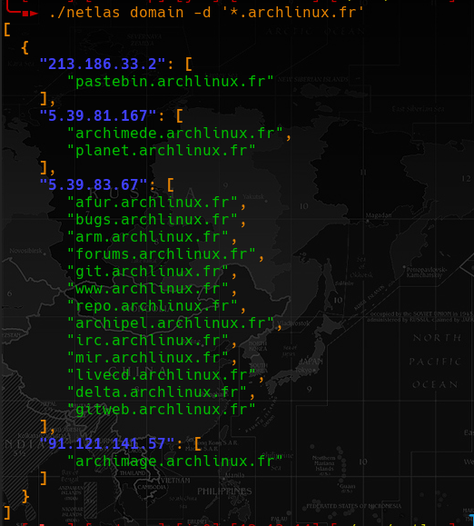

# Netlas go

Search on https://netlas.io for domain, vulns, hosts with same favicon etc ...




## Build/Install

```sh
$ git clone https://github.com/mmpx12/netlas-go.git
$ cd netlas-go
$ make
$ sudo make install
```

## Usage

```
Usage:
  netlas [command]

Available Commands:
  completion  Generate the autocompletion script for the specified shell
  domain      Search for domain
  favicon     Search from favicon
  help        Help about any command
  init        Save api key and server to file
  profile     Get profile info
  query       Search for custom query
  vulns       Search host by cve

Flags:
  -h, --help   help for netlas
```

## Init

`netlas init` will ask for server and api key and will save them to **$HOME/.netlas**. 

This step is not mandatory since you still can pass api key via `-a|--api-key` flags.

#### example:

```
netlas init
init
? Netlas server (domain or ip) https://app.netlas.io
? Netlas api key:  ********************************
✓  Configuration updated
```

## Profile

Print information about profile

#### usage:

```
Get profile info

Usage:
  netlas profile [flags]

Flags:
  -a, --api-key string   Specify api key (overwrite config file)
  -f, --format string    Select output format (yaml/json) (default "yaml")
  -h, --help             help for profile
  -n, --no-colors        Disable colors
```

## Domain

Search for domains/subdomains. By default it will parse the result. If you want to have full resulat, use the `-r|--raw` flag.

Without `-p|--page`, it will print the first page, use the flag for have more results.

You can use wildcard such as follows:

```sh
$ netlas domain -d "*.archlinux.fr" 
...
$ netlas domain -d "archlinux.*"
```

#### usage: 

```
Search for domain

Usage:
  netlas domain [flags]

Flags:
  -a, --api-key string   Specify api key (overwrite config file)
  -d, --domain string    Serch domain
  -f, --format string    Select output format (yaml/json) (default "json")
  -h, --help             help for domain
  -n, --no-colors        Disable colors
  -p, --page int         Page number (default 1)
  -r, --raw-result       Print raw results
``` 

### Favicon

Search for ip/domain than have the same favicon.
You can use url (`-u|--url`) or a local file (`-F|--file`).

#### usage:

```
Search from favicon

Usage:
  netlas favicon [flags]

Flags:
  -a, --api-key string   Specify api key (overwrite config file)
  -F, --file string      Path of the favicon file
  -f, --format string    Select output format (yaml/json) (default "yaml")
  -h, --help             help for favicon
  -n, --no-colors        Disable colors
  -r, --raw-result       Print raw results
  -u, --url string       Url of the favicon
```

#### example:

```sh
netlas favicon -u "https://cve.mitre.org/favicon.ico" -f json
```

```json
[
  {
    "date": "2022-01-21",
    "domain": null,
    "ip": "137.220.40.246"
  },
  {
    "date": "2022-01-21",
    "domain": null,
    "ip": "198.49.146.238"
  },
  {
    "date": "2022-01-21",
    "domain": [
       "cveform.mitre.org"
    ],
    "ip": "198.49.146.153"
  },
  {
    "date": "2022-01-21",
    "domain": [
       "recommendationtracker.mitre.org",
       "msm.mitre.org",
       "cve.mitre.org",
       "cce.mitre.org",
       "cybox.mitre.org",
       "makingsecuritymeasurable.mitre.org",
       "oval.mitre.org",
       "cme.mitre.org",
       "taxii.mitre.org",
       "capec.mitre.org",
       "cpe.mitre.org",
       "cee.mitre.org",
       "stix.mitre.org",
       "maec.mitre.org"
    ],
    "ip": "198.49.146.233"
  }
]
```

## vulns

You can search host by cve from:

- cve id
- minimum cve score
- cve with exploit

#### usage:

```
Search host by cve

Usage:
  netlas vulns [flags]

Flags:
  -a, --api-key string     Specify api key (overwrite config file)
  -i, --cve-id string      Serch for cve id
  -f, --format string      Select output format (yaml/json) (default "json")
  -x, --has-exploit        Serch host with cve that have exploit
  -h, --help               help for vulns
  -m, --min-score string   Minium score of cve to search (default "0")
  -n, --no-colors          Disable colors
  -p, --page int           Page number (default 1)
  -r, --raw-result         Print raw results
```

#### example:

Search for cve that have exploit and with a score higher than 9.5 on page 120

`netlas vulns -m "9.5" -x -p 120`

```json
[
  {
    "cve": [],
    "ip": "192.188.53.113"
  },
  {
    "cve": [
       "CVE-2017-7269 (9.8)",
       "CVE-2001-0500 (10.0)"
    ],
    "ip": "192.190.252.93"
  },
  {
    "cve": [
       "CVE-2017-7679 (9.8)"
    ],
    "ip": "192.190.239.163"
  }
]
```

## query

Search for custom query

#### usage:

```
Usage:
  netlas query [flags]

Flags:
  -a, --api-key string   Specify api key (overwrite config file)
  -f, --format string    Select output format (yaml/json) (default "json")
  -h, --help             help for query
  -n, --no-colors        Disable colors
  -p, --page int         Page number (default 1)
  -d, --query string     Serch domain
  -r, --raw-result       Print raw results
```

